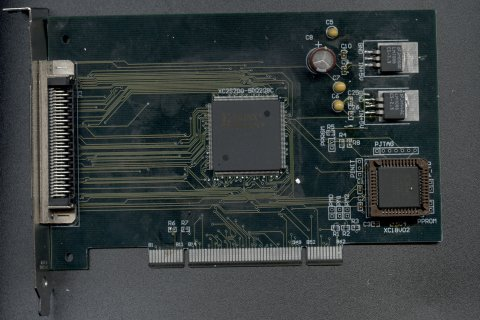

## A small versatile pci board using Spartan-II at 200k gates

The v1.0 of the board is builded, tested with opencores [pci core](https://opencores.org/projects/pci).

## OpenCores.org project

 Original project as of **Dec 19, 2005**: https://opencores.org/projects/pci-board  
 Archived SVN repository: https://opencores.org/websvn/listing/pci-board

* The [schematic](web_uploads/PCI-CARD-SCH-v1.0.pdf) available as PDF document.
* The [pcb](web_uploads/PCI-Card-v1.0.pdf) design available as PDF document.

## Features

v 1.0 features:
- PCI interface fully working with opencore pci project.
- I/O pins routed externally to an external connector
- JTAG header, and small xilinx eeprom for holding the configuration.
- Jumper selects local eeprom or external download or debug.
- Project available in gerber for manufacturing.
- .ucf available specifically for use with ISE.
- Schematic available in pdf for description of the board.

v 2.0b features [To be Come]:
- Soon, as in-house prototype line will be upgraded.
- Bigger chip, projected to use Spartan-III 1500/2000 BGA.
- More I/O pins with daughter card possibility expansion.
- SD card support, onboard flash, one I2C flash and 2x16bit wide SDRAM @100Mhz.
- TI high speed A/D chip [~200MS/s]with 2x analog input, analog level control with OPA via i2c.
- One more additional FPGA chip Spartan-III 50k gates for math computing of A/D signal.

## Status

V1.0 Status:

- Prototype manufactured in-house.
- Electrically tested, passed noise or voltage stability issues.
- PCI Core syntesed, tested with small gpio application using a linux driver.
- Not tested for full PCI compliance, speed or other edge parameters.

V2.0 Status
- Project finished, no prototype board executed yet.
- Soon.

## Availability

For people interested in board acquisition it is possible to manufacture a few pieces at low cost, please contact the author, requests accepted only for Eastern Europe.
